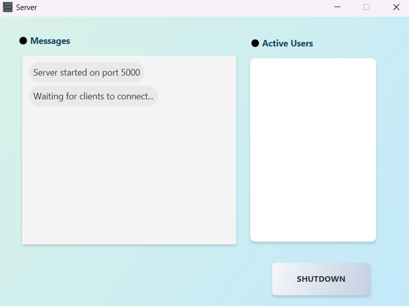
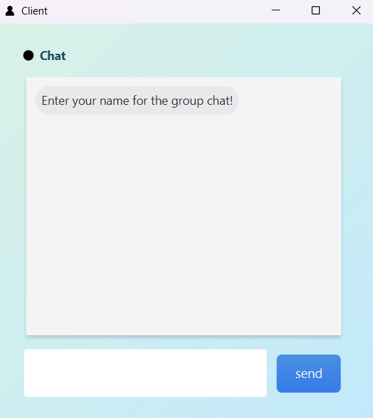
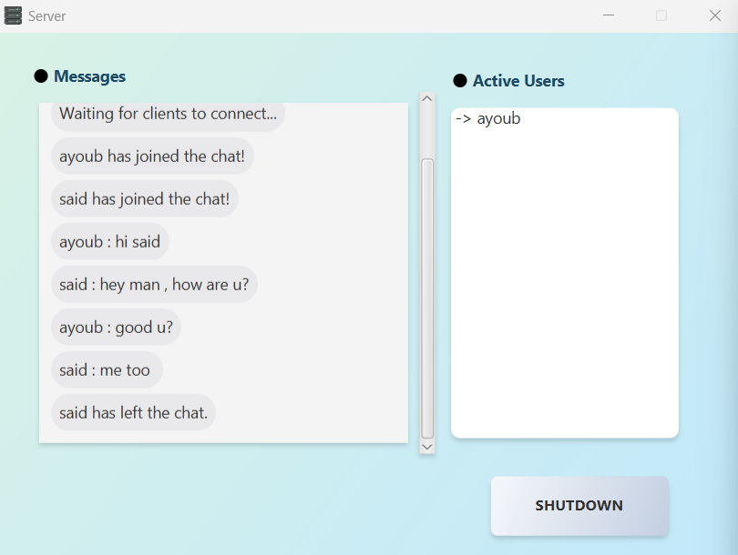
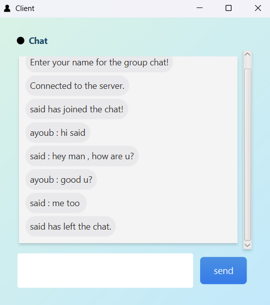
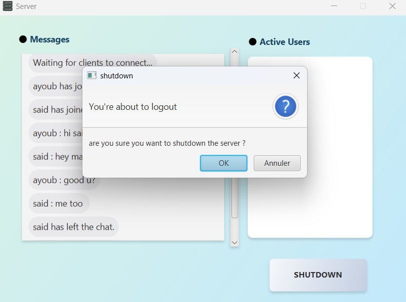

# JavaFX Multi-Client Socket Chat App

A robust multiple client chat application built using Java sockets and JavaFX. The user interface is designed using SceneBuilder and styled with CSS. Developed and tested in Eclipse, this project provides a solid foundation for real-time communication applications.

## Overview

This project demonstrates how to create a multi-client chat application using Java sockets for networking and JavaFX for a modern, responsive UI. The server handles multiple client connections simultaneously, broadcasting messages to all connected clients in real-time.

## Features

- **Real-time Messaging:** Broadcast messages instantly to all connected clients.
- **Multiple Clients:** Supports multiple users connecting simultaneously.
- **User Interface:** Built with JavaFX and SceneBuilder for an intuitive and interactive experience.
- **Custom Styling:** Uses CSS for UI customization.
- **Eclipse-Friendly:** Developed in Eclipse, making it easy to import and extend.

## Technologies Used

- **Java Sockets:** For handling network communications.
- **JavaFX:** For creating the user interface.
- **SceneBuilder:** For designing the FXML layouts.
- **CSS:** For styling the UI components.
- **Eclipse:** The integrated development environment (IDE) used for development.

